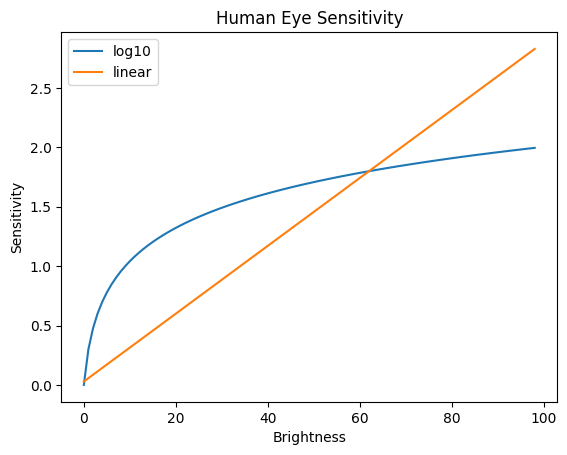
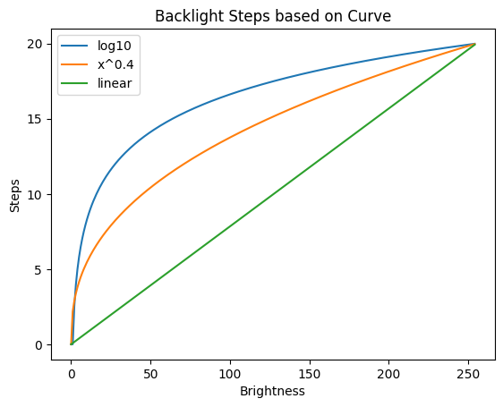

# kde-logarithmic-brightness

Set KDE Plasma 5 / Plasma 6 to use a logarithmic scale while setting backlight brightness following human eye perception while using Brightness Up/Down Keys (Function Keys)

## Prerequisite

This code is for KDE5 User only, should work on Xorg and Wayland(see below for some expected behaviour).
Uses d-bus to retrieve and set values so no sudo privileges are required.
Python 3.x needed.

Using the exposed node like `/sys/class/backlight/<device>` requires root user instead.  
For user of xbacklight see: [This Link](https://konradstrack.ninja/blog/changing-screen-brightness-in-accordance-with-human-perception/) from konradstrack

## Why?
As stated already as far as 1936 [Article Here](https://www.ncbi.nlm.nih.gov/pmc/articles/PMC2213727/), human eyes don't perceive brightness in a linear way, but much more as a logarithmic scale.
This phenomenon is known as [Weber–Fechner law](https://en.wikipedia.org/wiki/Weber%E2%80%93Fechner_law), the difference in sensibility is shown in the graph below.  
  


In Linux, lots of DE and Drivers manage brightness linearly but it doesn't respect human eye perception.  
This code is a *WorkAround* to work with Brightness Up and Down Keys available in most of the modern keyboards.  

By default, I used an exponential function instead, with an exponent between 0 and 1 (exclusive).  
These functions are essentially irrational functions (like the square root, that is basically the same as _a<sup>0.5</sup>_) and have a similar curve to the logarithmic ones for values not too high.
  
That's because the logarithmic curve is a bit too steep for most use cases.  
Most of the GPU Drivers have a brightness value settable between 0(off) and 255(max), while user can set from 0 to 100 in 20 step (+5 each step) from GUI. 
  
Using a pure logarithmic curve isn't the best, because, with 20 steps, low values are too near and some steps repeat the same value of brightness, while high values are too far away.  
Furthermore, it needs extra control for value 0 as log10(0) isn't defined.

I found as a good compromise the use of y = x<sup>0.4</sup>  
  


The value of 0.4 as exponent is a good compromise when:
- Min Brightness is 0
- Max Brightness is 255
- Number of Steps is 20  
It partially linearizes the values, low steps are decently divided and no values are repeated, as visible in this simulation, available in the code.

```
Linear for comparison:  
Values:  [255, 242, 230, 217, 204, 191, 178, 166, 153, 140, 128, 115, 102, 89, 76, 64, 51, 38, 26, 13]  
--- Default Values ---  
Exponential factor of 0.40:  
Values:  [255, 224, 196, 170, 146, 124, 105, 87, 71, 57, 45, 35, 26, 18, 13, 8, 5, 2, 1, 0]  
--- Logarithmic Values ---  
Logarithmic:  
Values:  [255, 193, 147, 111, 84, 64, 48, 37, 28, 21, 16, 12, 9, 7, 5, 4, 3, 2, 2, 1]  
--- Custom Values ---  
Exponential factor of 0.30:  
Values:  [255, 215, 179, 148, 121, 98, 78, 61, 46, 35, 25, 18, 12, 8, 5, 3, 1, 0, 0, 0]  
```

As shown above, log curve too rapidly decrease and some values are repeated. 
Repeated values are also in 0.3 curve, available as comparison.

## Getting Started

- Download the package and move it in a stable directory because py code will be called from there.
- Open a terminal and get into the package folder: `cd <path/to/>logarithmic-brightness`
- run `chmod u+x ./sh/eye-perception_backlight_kde_off.sh && chmod u+x ./sh/eye-perception_backlight_kde_on.sh`
- run `./sh/eye-perception_backlight_kde_on.sh`
- While restarting kglobalaccel the terminal could print some logs. Wait a few seconds then close it.
- NB: For Wayland users Kwin is too integrated in wayland and restarting kglobalaccel don't work (apparently, 
  it doesn't have a dbus entry to restart) because kwin_wayland is a component inside the server itself. Please reboot the pc for modification to take effect.

## Settings

If you want to try a pure logarithmic function:
- please remove previous modification by running `./sh/eye-perception_backlight_kde_off.sh`;
- then run `./sh/eye-perception_backlight_kde_on.sh log` instead.  

If you want change the exponent used to calculate values, add the esp parameter to `get_new_backlight` method call in `__init__.py`.  
  
In `__init__.py` is also possible to change: 
- min_value (default=0) 
- max_value (default=value in dbus node org.kde.Solid.PowerManagement.Actions.BrightnessControl.brightnessMax, usually is 255) 
- number of steps (default=20)

## Remove the WorkAround

If you don't like the modification and want to restore original values, run `./sh/eye-perception_backlight_kde_off.sh`.  
You can also use the _shortcut editor_ available in _system setting_ to restore to default or modify the behaviour.  
NB: For Wayland users Kwin is too integrated in wayland and restarting kglobalaccel don't work (apparently,
it doesn't have a dbus entry to restart) because kwin_wayland is a component inside the server itself. Please reboot the pc for modification to take effect.

## Simulation

A simple simulation code is available if you want to try different max, min, steps or esp values.  
Set this values, available at the top of the simulation.py code, then run it.   
It will display simulated brightness values for each step based on your settings for linear, logarithmic, default(0,4) exponential and you custom esp value curves.

## Known Limitations

Pressing up/Down Brightness Keys is a bit less responsive due to python code being executed.  
This code is to be considered a workaround. A setting could be added in KDE directly.  
User slider for brightness doesn't change equally due to the not linear nature of the function called.  
Because of the direct translation of driver values (from 0 to 255) to user values (0 - 100), I'm not able to hide the changes behind: I can't get +5 steps in UI as the default while keeping with inner brightness logarithmic. 
This could be achieved by directly changing KDE behaviour.

## Acknowledgement

This code is inspired by konradstrack's one available [Here](https://konradstrack.ninja/blog/changing-screen-brightness-in-accordance-with-human-perception/)  
If you use xbacklight you can use his guide.

## No warranties
Code Released 'AS IS', no warranties.
